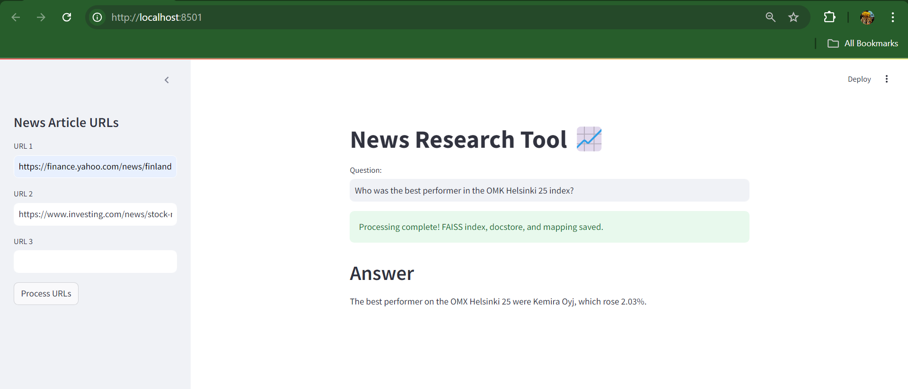

# News Research Tool 📈

This project is a user-friendly tool that helps you find information quickly from news articles, particularly in the stock market and financial domain. With this tool, you can input article URLs, process the content, and ask questions to get relevant insights.

## Screenshot



## Features

- **Input Article URLs**: Users can enter URLs of news articles to fetch and process their content.
- **Efficient Content Processing**: The tool uses LangChain's UnstructuredURLLoader to gather and process article content.
- **Smart Information Retrieval**: It leverages OpenAI's embeddings and FAISS, a powerful similarity search library, to help you retrieve relevant information quickly.
- **Interactive Query System**: Users can input questions and receive answers along with the sources, making research easy and effective.

(System.png)


## How to Use

1. **Clone the Repository**: 
   ```bash
   git clone https://github.com/Rohitn96/news-research-tool.git
   ```
   
2. **Install Dependencies**: 
   Navigate to the project directory and install the required packages.
   ```bash
   pip install -r requirements.txt
   ```

3. **Set Up Your API Key**: 
   Add your OpenAI API key to the `.env` file:
   ```
   OPENAI_API_KEY=your_openai_api_key
   ```

4. **Run the Application**: 
   Start the Streamlit app by running:
   ```bash
   streamlit run main.py
   ```

5. **Use the Tool**:
   - **Input URLs**: Enter up to three article URLs in the sidebar.
   - **Process URLs**: Click "Process URLs" to analyze the articles.
   - **Ask Questions**: Type your question in the main input field to receive answers based on the processed content.

